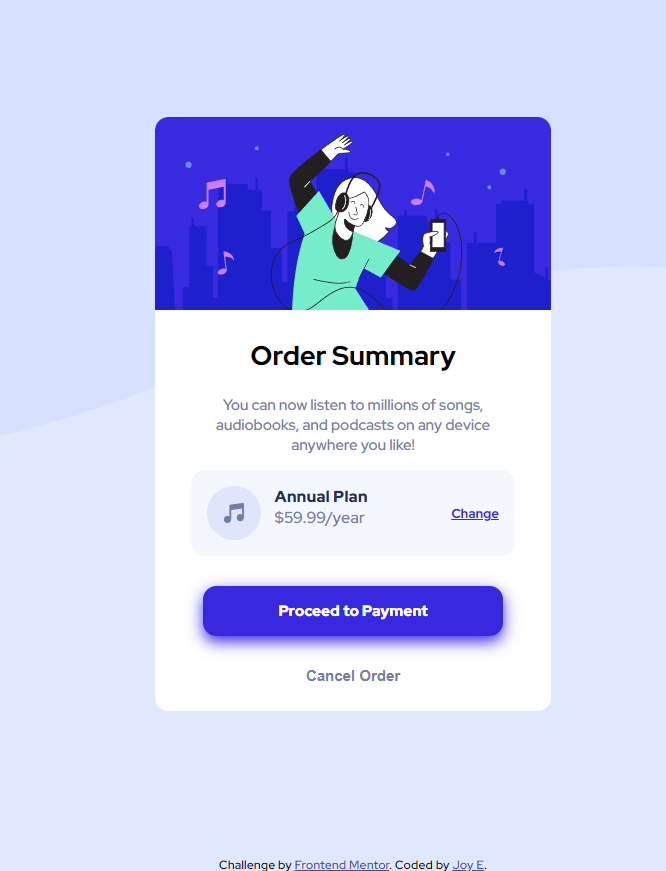

# Frontend Mentor - Order summary card solution

This is a solution to the [Order summary card challenge on Frontend Mentor](https://www.frontendmentor.io/challenges/order-summary-component-QlPmajDUj). Frontend Mentor challenges help you improve your coding skills by building realistic projects. 

## Table of contents

- [Overview](#overview)
  - [The challenge](#the-challenge)
  - [Screenshot](#screenshot)
  - [Links](#links)
- [My process](#my-process)
  - [Built with](#built-with)
  - [What I learned](#what-i-learned)
  - [Continued development](#continued-development)
  - [Useful resources](#useful-resources)
- [Author](#author)
- [Acknowledgments](#acknowledgments)

## Overview

### The challenge

Users should be able to:

- See hover states for interactive elements

### Screenshot

### Links

- Solution URL: [github](https://github.com/joy-joy2001/order-summary-component-main)
- Live Site URL: [live site](https://joy-joy2001.github.io/order-summary-component-main/)

## My process

### Built with

- Semantic HTML5 markup
- Flexbox
- Next on my learning agenda:
  --> CSS custom properties
  --> CSS Grid
  --> Mobile-first workflow

### What I learned

I learnt Flexbox and how to use it; its truly a powerful layout tool however I feel like I need more practice in it and I think maybe this wasn't the right project to practice flexbox in as it was quite difficult for me but hey-ho, I learnt a lot of things...
Don't even bother viewing in on mobile yet cos I still don't get media queries...

### Continued development

Will go back to my previous project, the 3-card component preview thingy and try to recreate the project using flexbox!
Relative and Absolute units is another thing. The way I was just guessing how many 'ems' this thing should be and the other thign should be!! I;m sure theres a more succint way to use these types of measurements. I understand using percentages but I decided I wanted to go withs 'em' this time round and I still don't understand how it works. All I know is that it just does... 

PS...
I'm gonna redo this site again cos ngl, I feel like this could have been written with less CSS. At one point I got frustrated and I said 'bun this, I'll just repeat the rules...' Obviously not a good trait for a programmer to have, its just that I was learning Flexbox and it really grinded my gears so I neglected using the proper guidelines LOOOL

### Useful resources

- [Flexbox Froggy](https://flexboxfroggy.com/) - How I gained a basic understanding in flexbox.
- [Flexbox Adventure](https://codingfantasy.com/games/flexboxadventure) - Another game which was useful to understanding flexbox - I'd recommend it to anyone still learning this concept.

## Author

- Website - [Add your name here](https://joy-joy2001.github.io/order-summary-component-main/)

## Acknowledgments

Made by yours truly, 
Joy
